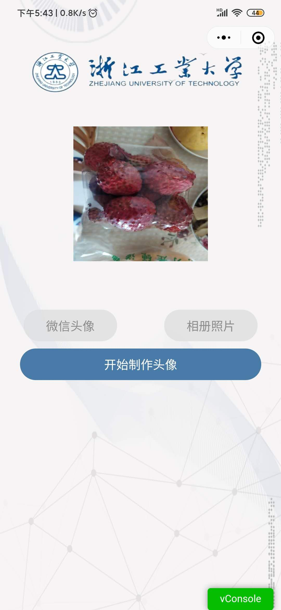
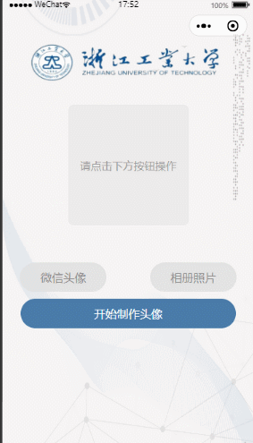

# zjutAvatar

> 一个通过获取微信头像或者上传照片添加相框的微信小程序

## 需求分析

打开小程序实现如下功能：

- [x] 用户打开小程序在头像展示区进行友好提示 “请点击下方按钮操作”

- [x] 用户点击“微信头像”按钮，将用户微信头像展示在展示区

- [x] 用户点击“相册照片”可以上传图片展示在展示区

- [x] 若用户点击“微信头像”或“相册照片”，再点击“开始制作头像”则进入制作头像页面，否则进行友好提示“请选择头像”

- [x] 用户点击对应的相框，展示区出现相框和用户所选头像的结合体，相框列表可以向左划，用户点击“保存”后则保存到用户相册，用户点击“返回”则返回上一个，若用户未选择相框点击“保存”，则进行相应友好提示。

## 功能展示

首页


点击获取头像


点击相册照片



相应相框选择


结果一


结果二


演示




### 版本二

首页


相应相框选择


演示


#### 版本三

图一


图二


上线啦


## 知识点梳理

### 一些标签

* `view`

* `text`

* `button`

* `scroll-view`

* `canvas`

* `image`

* `block`

### 小程序页面跳转

#### wxml页面中的跳转方式

* `<navigate></navigate>`

[点击查看文档](https://developers.weixin.qq.com/miniprogram/dev/component/navigator.html)


#### js中的跳转API

* `wx.navigateTo({url, success, fail, complete})` 不能跳到 tabbar 页面

* `wx.redirectTo({url, success, fail, complete})` 不能跳到 tabbar 页面

* `wx.switchTab({url, success, fail, complete})`

* `wx.navigateBack({delta})` 1.0.0+

[点击查看文档](https://developers.weixin.qq.com/miniprogram/dev/api/route/wx.switchTab.html)

### 小程序事件绑定

* 在`wxml`中可以使用`bindtap`进行绑定点击事件

* 如果要传入参数的话在对应标签使用`data-xxx`,然后通过`event.target.dataset.xxx`或者`event.currentTarget.dataset.xxx`

[点击查看文档](https://developers.weixin.qq.com/miniprogram/dev/framework/view/wxml/event.html)

### 一些相关API整理

#### 获取用户头像

* `wx.getUserinfo()`

[点击查看文档](https://developers.weixin.qq.com/miniprogram/dev/api/open-api/user-info/wx.getUserInfo.html)

#### 是否有获取用户头像权限

* `wx.canIUse('button.open-type.getUserInfo')`

使用 `${API}.${method}.${param}.${option}` 或者 `${component}.${attribute}.${option}` 方式来调用

[点击查看文档](https://developers.weixin.qq.com/miniprogram/dev/api/base/wx.canIUse.html)

#### 选择手机相册图片

* `wx.chooseImage()`

[点击查看文档](https://developers.weixin.qq.com/miniprogram/dev/api/media/image/wx.chooseImage.html)

#### 保存到手机相册

* `wx.saveImageToPhotosAlbum()`

[点击查看文档](https://developers.weixin.qq.com/miniprogram/dev/api/media/image/wx.saveImageToPhotosAlbum.html)

#### 下载网络图片

* ` wx.downloadFile()`

[点击查看文档](https://developers.weixin.qq.com/miniprogram/dev/api/network/download/wx.downloadFile.html)

#### 显示弹框信息

* `wx.showToast()`

[点击查看文档](https://developers.weixin.qq.com/miniprogram/dev/api/ui/interaction/wx.showToast.html)

#### canvas绘制相关API

* `wx.createCanvasContext('canvas-id')`

 创建 canvas 的绘图上下文 CanvasContext 对象

* `wx.canvasToTempFilePath()`

把当前画布指定区域的内容导出生成指定大小的图片。在 draw() 回调里调用该方法才能保证图片导出成功。

* `cvsCtx.save()`

保存绘图上下文

* `cvsCtx.arc(x, y, r, 0, 2 * Math.PI)`

创建一条弧线,这里我写的是一个圆

* `cvsCtx.clip()`

从原始画布中剪切任意形状和尺寸

* `cvsCtx.drawImage(img, x, y, w, h)`

绘制图像到画布

* `cvsCtx.restore()`

恢复之前保存的绘图上下文

* `cvsCtx.draw()`

将之前在绘图上下文中的描述（路径、变形、样式）画到 canvas 中

[点击查看文档](https://developers.weixin.qq.com/miniprogram/dev/api/canvas/wx.createCanvasContext.html)


#### 相关属性设置

* `this.setData({key: value})`

[点击查看文档](https://developers.weixin.qq.com/miniprogram/dev/framework/performance/tips.html)


#### 关于Access Token 

* 手动获取Access Token

* 自动刷新Access Token

* 需提供AppId, AppSecret

* 有效期两小时

* 512空间字符

* 有5分钟新旧Access Token 平滑过渡。

[点击查看文档](https://developers.weixin.qq.com/miniprogram/dev/api-backend/open-api/access-token/auth.getAccessToken.html)

#### 关于云函数

看官当文档很详细的，这里列几个点

* 云函数初始化

* 小程序端云函数初始化

* 小程序端云函数调用

* 云函数端访问数据库

* 小程序端访问数据库

* 云函数端访问外部接口

[点击查看文档](https://developers.weixin.qq.com/miniprogram/dev/wxcloud/basis/getting-started.html)


## 问题汇总：

### 微信小程序的大小限制

微信小程序的大小不允许超过2MB。

### 微信小程序元素的`background`属性无法使用本地图片

**解决方案：** 

* 网络图片

* 转base64： http://base64.xpcha.com/

* 使用`<image/>`标签

### 如何设置小程序全屏背景

**解决方案：** 

* 在`app.json`中设置如下

```js
 "window": {
    "navigationStyle": "custom"
  },
```
* 将page的高度设置成如下

```js
page {
  height: 100%;
}
```
### canvas绘制网络图片的时候获取不到

**解决方案：** 

* 先将对应域名加入到downloadFile的合法域名列表中

* 然后调用downloadFile的方法

### 小程序Canvas隐藏问题处理

**解决方案：** 

试了下`display`, `overflow`都不好使， 使用定位将其定位到小程序外面去，使用户看不到


### UGC类小程序需要进行内容安全过滤

```
失败原因1
审核失败原因存在平台未允许的服务内容，违反《微信小程序平台运营规范常见拒绝情形3.2》
详情描述为避免您的小程序被滥用，请你完善内容审核机制，如调用小程序内容安全API，或使用其他技术、人工审核手段，过滤色情、违法等有害信息，保障发布内容的安全。
```


推荐使用微信官方接口和云函数开发

## 参考文献

[小程序官方文档](https://developers.weixin.qq.com/miniprogram/dev/framework/quickstart/#小程序简介)

## 鸣谢

**美术指导：** sisi

**技术支持：** ataola


